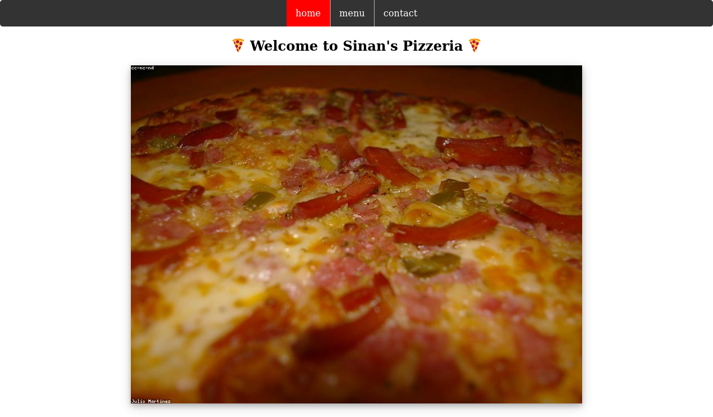

## Restaurant Page
This is a simple restaurant homepage created for practicing DOM manipulation by dynamically rendering pages with js.



## Built With

- HTML
- CSS
- JS
- Webpack

## Live Demo
[Live Demo](https://sinansevgi.github.io/Restaurant_Page/)

## Getting Started

* Clone this repo
    ```
    git clone https://github.com/sinansevgi/Restaurant_Page.git
    ```
#### Without Node.js
* Open project directory.
* Open dist directory.
* Navigate index.html with your browser.

#### With Node.js
* Open project directory.
* Run the npm install 
* npm run start:dev to start the start application.
* You can also double click or run startserver.sh from terminal to start a live server.

## Authors
👤 **Sinan Sevgi**
- GitHub: [@sinansevgi](https://github.com/sinansevgi)
- LinkedIn: [@sinansevgi](https://www.linkedin.com/in/sinansevgi/)
- Portfolio: [Website](https://sinansevgi.com)

## Contributing

Contributions, issues, and feature requests are welcome!

Feel free to check the [issues page](https://github.com/sinansevgi/Restaurant_Page/issues).


## Acknowledgements

- [**Project Description**](https://www.theodinproject.com/courses/javascript/lessons/restaurant-page)

## Show your support

Give a ⭐️ if you like this project!

## 📝 License

This project is [MIT](LICENSE) licensed.


